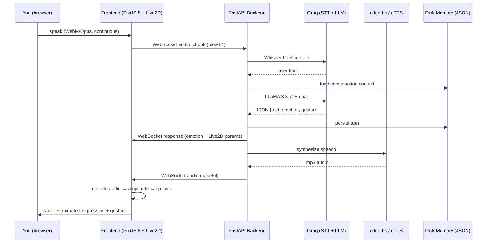

# Lucie — Live 2D AI Companion

> A real-time, hands-free Live2D AI companion that hears you, talks back with a natural voice, and reacts with genuine emotion — all through one full-screen animated character.

[](https://www.python.org/downloads/) [](https://fastapi.tiangolo.com/) [](https://groq.com/) [](https://render.com/)

**[Report a Bug](https://github.com/vincenzo-afk/Lucie-AI/issues)** · **[Request a Feature](https://github.com/vincenzo-afk/Lucie-AI/issues)**

---

## <a name="toc"></a>Table of Contents

- [About the Project](#about)
- [Tech Stack](#tech-stack)
- [Getting Started](#getting-started)
- [Usage](#usage)
- [API Reference](#api-reference)
- [Project Structure](#project-structure)
- [Features & Roadmap](#features-roadmap)
- [Testing](#testing)
- [Deployment](#deployment)
- [Contributing](#contributing)
- [Security](#security)
- [License](#license)
- [Acknowledgments](#acknowledgments)

---

## <a name="about"></a>About the Project

Lucie is a conversational AI companion delivered as a **living 2D anime character**. Instead of a traditional chat window, you talk to Hiyori — an official Live2D Pro model rendered full-screen — and she responds the way a real person on a video call would: with a voice, facial expressions, body gestures, and memory of your past conversations.

The design problem the project solves is the emotional flatness of typical chatbot interfaces. Every reply from the large language model (LLM) carries an **emotion tag** and an optional **gesture tag**, which the frontend translates into Live2D parameter targets and motion playback, while the actual synthesized speech waveform drives real-time lip sync. The result is a character that looks, sounds, and behaves like someone who is genuinely engaged in the conversation.

### How it works

1. **Live2D character** — The avatar is the official **Hiyori Pro (Cubism 4)** model from Live2D Inc., the same quality tier used in commercial VTuber applications. Her mouth, eyes, brows, blush, and body move live on a PixiJS 8 canvas, driven by actual TTS waveform amplitude analysis — she literally *talks*.
2. **Listening** — The browser records your voice continuously (WebM/Opus) and auto-detects when you stop speaking using voice activity detection. No push-to-talk button required.
3. **Thinking** — Your audio is transcribed by **Groq Whisper**, then **LLaMA 3.3 70B** on Groq replies in character with an emotion tag (`happy`, `sad`, `surprised`, `blush`, `laugh`, `worried`, `neutral`) and an optional gesture tag.
4. **Talking** — **edge-tts** synthesizes a natural female neural voice (`en-US-AnaNeural`). The frontend decodes it with the Web Audio API and streams amplitude into the `ParamMouthOpenY` parameter every frame for real lip sync.
5. **Remembering** — Every exchange is persisted to disk, so she recalls your name, hobbies, and shared memories across sessions.

### Architecture



---

## <a name="tech-stack"></a>Tech Stack

| Layer | Technology | Version |
|---|---|---|
| Backend framework | FastAPI (with WebSockets) | 0.115.0 |
| ASGI server | Uvicorn (standard) | 0.30.6 |
| LLM inference | Groq API — LLaMA 3.3 70B | `llama-3.3-70b-versatile` |
| Speech-to-text | Groq Whisper | `whisper-large-v3-turbo` |
| Text-to-speech | edge-tts (primary), gTTS (fallback) | 6.1.12 / 2.5.4 |
| Data validation | Pydantic | >= 2.10.0 |
| Env config | python-dotenv | 1.0.1 |
| Frontend runtime | Vanilla JS (ES modules), PixiJS 8 | 8.x |
| Character engine | untitled-pixi-live2d-engine + Cubism Core SDKs (2.1 & 4/5) | — |
| Character | Hiyori Pro (official Live2D model) | Cubism 4 Pro |
| Audio | Web Audio API, MediaRecorder (WebM/Opus) | browser-native |

---

## <a name="getting-started"></a>Getting Started

### Prerequisites

| Requirement | Details |
|---|---|
| Python | 3.10 or newer |
| Groq API key | Free key from [console.groq.com](https://console.groq.com/) — required for STT and LLM |
| Microphone | For hands-free voice input (browsers require HTTPS or localhost) |
| Modern browser | Chrome, Edge, or Firefox with Web Audio and MediaRecorder support |

No database server is required — conversation history is stored in a plain JSON file on disk.

### Installation

```bash
# 1. Clone the repository
git clone https://github.com/vincenzo-afk/Lucie-AI.git
cd Lucie-AI

# 2. Install Python dependencies
pip install -r backend/requirements.txt

# 3. Configure environment
cp .env.example .env
# Edit .env and paste your Groq API key:
# GROQ_API_KEY=gsk_...
```

### Configuration

All configuration is read from environment variables (loaded via `python-dotenv` when you run from the repo root):

| Variable | Default | Description |
|---|---|---|
| `GROQ_API_KEY` | *(required)* | Your Groq API key for STT and LLM |
| `GROQ_LLM_MODEL` | `llama-3.3-70b-versatile` | Override the LLM model |
| `GROQ_STT_MODEL` | `whisper-large-v3-turbo` | Override the speech-to-text model |
| `HOST` | `0.0.0.0` | Bind address for uvicorn |
| `PORT` | `8000` | Port for uvicorn |
| `CORS_ORIGINS` | `*` | Comma-separated allowed origins |
| `MAX_MESSAGES_PER_MINUTE` | `10` | Sliding-window rate limit per connected client |

> **Note:** `.env.example` still contains legacy `GEMINI_API_KEY` entries from a previous iteration of the project. The codebase now uses Groq exclusively — only `GROQ_API_KEY` is needed.

### Running locally

```bash
uvicorn backend.main:app --host 0.0.0.0 --port 8000 --reload
```

Then open **[http://localhost:8000](http://localhost:8000)** — the FastAPI app serves the frontend at `/` alongside the chat API at `/ws/chat`.

### Health check

```bash
curl http://localhost:8000/health
# {"status":"ok","groq_configured":true}
```

---

## <a name="usage"></a>Usage

### Voice conversation (hands-free)

Open the app, click anywhere to grant microphone access, and start talking. Lucie auto-detects when you stop speaking, replies by voice, and her lips move in sync with the audio. The glowing subtitle orb pulses with her live voice amplitude.

### Text input (no microphone)

If you prefer typing, you can send a `text_message` over the WebSocket (documented below) — useful for headless testing or accessibility.

### Avatar interaction

Click or tap on Hiyori and she reacts with a random idle gesture motion (head shake, bow, or body motion). Between utterances she cycles her idle body motions, autonomous blinking, breathing, and gentle head sway; all idle animation pauses while she speaks.

### WebSocket example (Node.js)

```js
const ws = new WebSocket('ws://localhost:8000/ws/chat');

ws.onopen = () => {
  // Text input path
  ws.send(JSON.stringify({ type: 'text_message', text: 'Hey Lucie, how are you?' }));
};

ws.onmessage = (e) => {
  const msg = JSON.parse(e.data);
  if (msg.type === 'response') {
    console.log(`${msg.emotion} / ${msg.gesture}: ${msg.text}`);
    // msg.live2d_params → Hiyori parameter targets for the frontend animator
  }
  if (msg.type === 'audio') {
    // msg.audio_base64 → mp3 audio to play
  }
};
```

### WebSocket protocol

| Direction | Type | Payload |
|---|---|---|
| Client → Server | `audio_chunk` | `{ data: "<base64>", mime_type: "audio/webm" }` |
| Client → Server | `text_message` | `{ text: "..." }` |
| Client → Server | `ping` | `{}` — keep-alive |
| Server → Client | `response` | `{ transcript, text, emotion, gesture, live2d_params }` |
| Server → Client | `audio` | `{ audio_base64: "<base64>", format: "audio/mp3" }` |
| Server → Client | `pong` | `{}` — keep-alive reply |
| Server → Client | `error` | `{ message: "..." }` |

---

## <a name="api-reference"></a>API Reference

The backend exposes three HTTP-level surfaces; the conversation itself happens over the single `/ws/chat` WebSocket.

| Method | Path | Description |
|---|---|---|
| `GET` | `/` | Serves `frontend/index.html` — the full application UI |
| `GET` | `/health` | Service health; reports whether `GROQ_API_KEY` is configured |
| `WS` | `/ws/chat` | Real-time conversation channel (see protocol table above) |
| `GET` | `/js/*`, `/css/*`, `/live2d/*`, `/model/*` | Static frontend assets (JS modules, stylesheets, Live2D cores, character model) |

**Request example (`/health`):**

```bash
curl http://localhost:8000/health
```

**Response:**

```json
{
  "status": "ok",
  "groq_configured": true
}
```

The `/health` endpoint is the recommended way to verify deployment: if `groq_configured` is `false`, the Groq API key is missing from the environment.

**Rate limiting:** the WebSocket applies a sliding window of `MAX_MESSAGES_PER_MINUTE` messages (default 10) per client. Exceeding it returns an `error` message instead of processing the turn.

---

## <a name="project-structure"></a>Project Structure

```
Lucie-AI/
├── backend/
│   ├── main.py              # FastAPI entrypoint: routes, WebSocket, rate limiter
│   ├── config.py            # Env vars, system prompt, emotions & gestures config
│   ├── groq_client.py       # Groq API client (Whisper STT + LLaMA chat)
│   ├── tts_engine.py        # edge-tts synthesis with gTTS fallback
│   ├── emotion_engine.py    # Emotion → Live2D parameter mapping
│   ├── memory.py            # Persistent disk conversation memory
│   ├── audio_utils.py       # base64 ↔ bytes helpers
│   └── requirements.txt     # Pinned Python dependencies
├── frontend/
│   ├── index.html           # Application shell (stage, subtitles, mic orb)
│   ├── css/style.css        # Full-screen dark UI, glowing subtitle styles
│   ├── js/
│   │   ├── main.js          # App bootstrap; module imports with cache-busting tags
│   │   ├── live2d-loader.js # PixiJS 8 + Live2D model initialization
│   │   ├── emotion-animator.js  # Emotions, idle motions, gestures, lip sync
│   │   ├── audio-handler.js # Mic recording, VAD, Web Audio amplitude
│   │   ├── websocket.js     # Auto-reconnecting chat WebSocket client
│   │   └── ui-controller.js # Status bar, subtitles, mic button states
│   ├── live2d/core/         # Official Cubism 2.1 + Cubism 4/5 core SDKs
│   └── model/Hiyori/        # Hiyori Pro runtime (moc3, textures, 10 motions)
├── data/
│   └── memory.json          # Persisted conversation history
├── .env.example             # Environment variable template
├── build.sh                 # Render build command
├── Procfile                 # Render process definition
└── README.md                # This file
```

Key files worth knowing:

| File | Role |
|---|---|
| `backend/config.py` | Single source of truth for the persona system prompt, emotion vocabulary, gesture vocabulary, and per-emotion Live2D parameter targets |
| `backend/groq_client.py` | All calls to Groq (STT + LLM) with JSON extraction and resilient REST calling |
| `frontend/js/emotion-animator.js` | The heart of the character: idle motion cycling, talking bounce, gesture playback, expression animation, and per-frame lip sync |
| `frontend/js/websocket.js` | Connection lifecycle: auto-reconnect with backoff, keep-alive pings, honest connection status |

### Live2D parameters in use (Hiyori Pro)

| Parameter | Used for |
|---|---|
| `ParamEyeLOpen` / `ParamEyeROpen` | Blinking, expressions |
| `ParamEyeLSmile` / `ParamEyeRSmile` | Happy / laughing eyes |
| `ParamMouthForm` / `ParamMouthOpenY` | Smile / frown shape, talking + lip sync |
| `ParamCheek` | Blush |
| `ParamBrowLY` / `ParamBrowRY` | Sad / surprised brows |
| `ParamAngleX/Y/Z`, `ParamBodyAngleX/Y/Z` | Idle head/body sway |
| `ParamEyeBallX/Y` | Idle eye drift |
| `ParamBreath` | Idle breathing |

---

## <a name="features-roadmap"></a>Features & Roadmap

### Current features

- ✅ Microphone hands-free voice chat with automatic speech-end detection (VAD)
- ✅ Text input as an alternative to voice (via WebSocket)
- ✅ Emotion-driven Live2D expressions: `happy`, `sad`, `surprised`, `blush`, `laugh`, `worried`, `neutral`
- ✅ LLM-selected gestures (`touch_hair`, `play_hair`, `head_shake`, `head_nod`, `wave`, `giggle`, `point`, `blush`, `none`) with per-emotion defaults
- ✅ Live lip sync driven by the actual TTS waveform amplitude
- ✅ Hiyori idle body motions between utterances, paused during speech
- ✅ Autonomous blinking, breathing, and gentle head sway
- ✅ Persistent conversation memory across sessions (disk-backed JSON)
- ✅ Voice-reactive glowing subtitles tracking live voice amplitude
- ✅ Auto-reconnecting WebSocket with exponential backoff and keep-alive pings
- ✅ Click/tap-to-react on the avatar (random idle gesture motion)
- ✅ Sliding-window rate limiting per connected client
- ✅ gTTS fallback when the primary TTS provider is unreachable
- ✅ Stale-asset protection: frontend modules served with no-cache headers and version tags

### Limitations

- Speech input requires a modern browser with MediaRecorder support
- The character model is the official Hiyori Pro; swapping to other models requires a compatible `model3.json` (Cubism 4/5)
- Memory is a single shared JSON history file — no multi-user isolation yet

### Changelog

See the repository [commit history](https://github.com/vincenzo-afk/Lucie-AI/commits/main) for the full change log.

---

## <a name="testing"></a>Testing

The project does not currently ship an automated test suite; verification is done through the live application and the health endpoint.

```bash
# Verify the service boots and Groq is configured
curl http://localhost:8000/health

# Smoke-test the WebSocket text path
npx wscat -c ws://localhost:8000/ws/chat
> {"type":"text_message","text":"hello"}
```

CI/CD workflows are not yet configured. Contributions adding pytest suites for `backend/` modules and Playwright checks for the frontend are welcome.

---

## <a name="deployment"></a>Deployment

### Render (recommended)

The repository is deployment-ready for [Render](https://render.com/) — one web service hosts both the UI and the API.

1. Connect this repository to a new **Web Service** on Render.
2. Configure:
   - **Build Command:** `./build.sh`
   - **Start Command:** `uvicorn backend.main:app --host 0.0.0.0 --port $PORT`
   - **Environment variable:** `GROQ_API_KEY` — your Groq API key
3. Deploy. The frontend automatically uses `ws://localhost:8000` locally and `wss://<render-host>` in production.

### Self-hosting

The stack has no external dependencies beyond Groq's API, so any VPS or Docker host works:

```bash
docker run -it --rm -p 8000:8000 \
  -e GROQ_API_KEY=your_key \
  -v "$(pwd)":/app -w /app python:3.12 \
  bash -c "pip install -q -r backend/requirements.txt && \
           uvicorn backend.main:app --host 0.0.0.0 --port 8000"
```

Note that WebSocket connections need a stable proxy configuration (`proxy_read_timeout` ≥ 60s) if you place nginx in front.

---

## <a name="contributing"></a>Contributing

Contributions are welcome. The repository has historically used conventional-commit-style messages (`feat:`, `fix:`, `refactor:`, `diag:`), which we encourage continuing. A suggested workflow:

1. Fork the repository and create a feature branch (`feat/your-feature`).
2. Keep changes small and focused; each commit should describe one logical change.
3. Test locally with `uvicorn backend.main:app --host 0.0.0.0 --port 8000 --reload` and verify the health endpoint plus a live conversation.
4. Open a pull request describing what changed and why.

There is no code of conduct or contributing guide yet — feel free to add one via pull request.

---

## <a name="security"></a>Security

- **Secrets:** the Groq API key is read exclusively from environment variables (`.env`, never committed). `.env` is gitignored; only `.env.example` is tracked.
- **Input validation:** incoming WebSocket messages are validated by type with explicit `error` responses for unknown payloads; malformed audio fails gracefully rather than crashing the turn.
- **Rate limiting:** a sliding-window limiter caps messages per client per minute, mitigating runaway usage and cost.
- **Static assets:** frontend modules are served with `Cache-Control: no-cache, no-store` and version tags so truncated or stale downloads can never execute silently.
- **CORS:** origins are configurable via `CORS_ORIGINS`; lock it down in production instead of relying on the `*` default.

To report a security vulnerability, open an issue on GitHub or contact the repository owner directly.

---

## <a name="license"></a>License

This project does not include a license file. The application code is owned by the repository author ([vincenzo-afk](https://github.com/vincenzo-afk)); the Hiyori Pro Live2D model and Cubism SDK cores remain the property of Live2D Inc. and are distributed under their respective licenses. If you intend to fork or redistribute, please request a license from the author or add one via pull request.

---

## <a name="acknowledgments"></a>Acknowledgments

- **Hiyori Pro** — official Live2D sample model ([Live2D Inc.](https://www.live2d.com/en/))
- **untitled-pixi-live2d-engine** — PixiJS 8 Live2D runtime
- **Groq** — Whisper STT and LLaMA 3.3 70B inference
- **edge-tts / gTTS** — neural text-to-speech
- Inspiration: commercial VTuber and AI-companion applications that proved how much presence a well-animated 2D character adds to conversation

---

[Built with ❤ by vincenzo-afk](https://github.com/vincenzo-afk) · [GitHub](https://github.com/vincenzo-afk/Lucie-AI)

Questions or ideas? Open an issue on [GitHub](https://github.com/vincenzo-afk/Lucie-AI/issues).

[⬆ Back to top](#toc)
