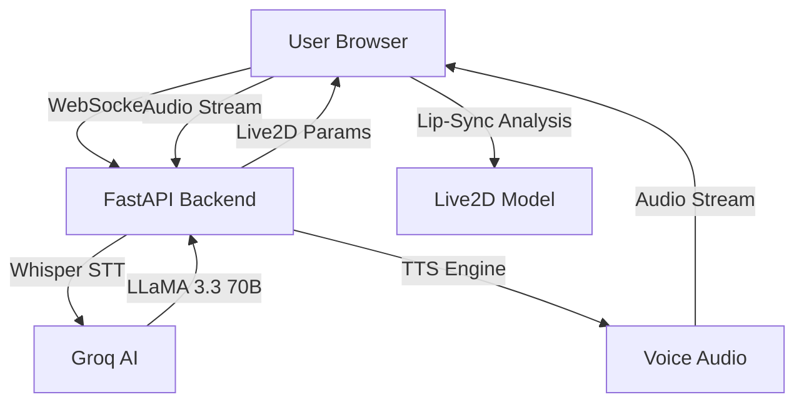

# Lucie-AI: Real-Time 2D Live AI Companion

Lucie-AI is a next-generation AI companion that combines state-of-the-art Large Language Models (LLMs) with high-fidelity Live2D animation. It features a real-time, voice-driven interaction system with low-latency responses, expressive emotions, and dynamic physical gestures.

## 🌟 Key Features

- **Live2D Hiyori Pro Integration**: Fully rigged Cubism 4 model with idle motions, blinking, breathing, and head sway.
- **Emotion-Driven Expressivity**: AI-detected emotions (happy, sad, blush, etc.) trigger specific Live2D parameter changes and expressive gestures.
- **Voice-First Interaction**: Real-time audio recording and streaming with Groq Whisper STT and ultra-fast TTS fallback.
- **Intelligent Lip-Sync**: Real-time audio waveform analysis drives the Live2D model's mouth movements for natural speech synchronization.
- **Groq-Powered Intelligence**: Leverages LLaMA 3.3 70B for affectionate, context-aware conversations with persistent memory.
- **Production-Ready Backend**: FastAPI-based architecture with WebSocket support, optimized for deployment on Render.

## 🏗️ Architecture



## 🚀 Quick Start

### Prerequisites

- Python 3.11+
- [Groq API Key](https://console.groq.com/)
- Modern web browser with Microphone access

### Installation

1. **Clone the repository:**
   ```bash
   git clone https://github.com/vincenzo-afk/Lucie-AI.git
   cd Lucie-AI
   ```

2. **Set up the environment:**
   ```bash
   python -m venv venv
   source venv/bin/activate  # On Windows: venv\Scripts\activate
   pip install -r backend/requirements.txt
   ```

3. **Configure Environment Variables:**
   Create a `.env` file in the root directory:
   ```env
   GROQ_API_KEY=your_groq_api_key_here
   PORT=8000
   ```

4. **Run the application:**
   ```bash
   python -m backend.main
   ```
   Open `http://localhost:8000` in your browser.

## 🛠️ Technical Stack

- **Frontend**: Vanilla ES Modules, PixiJS v8, Live2D Cubism 4 Core.
- **Backend**: FastAPI, Uvicorn, WebSockets.
- **AI/ML**: Groq Cloud (LLaMA 3.3 70B, Whisper-large-v3-turbo).
- **TTS**: edge-tts (Primary), gTTS (Fallback).
- **Deployment**: Render (Free/Starter Tier).

## 📂 Project Structure

- `/backend`: FastAPI application, AI clients, and TTS logic.
- `/frontend`: Web interface, Live2D assets, and animation engine.
- `/frontend/js`: Core animation and communication logic.
- `/frontend/model/Hiyori`: Hiyori Pro Live2D runtime assets.

## 🤝 Contributing

Contributions are welcome! Please feel free to submit a Pull Request. See [CONTRIBUTING.md](CONTRIBUTING.md) for details.

## 📄 License

This project is licensed under the MIT License - see the [LICENSE](LICENSE) file for details.

---
*Created by [vincenzo-afk](https://github.com/vincenzo-afk)*
